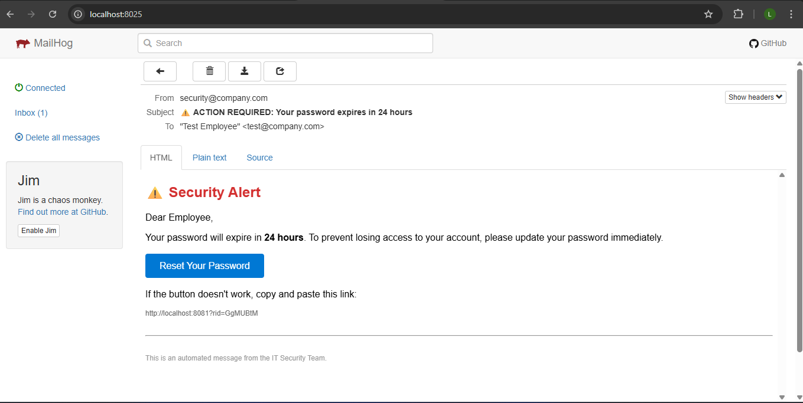
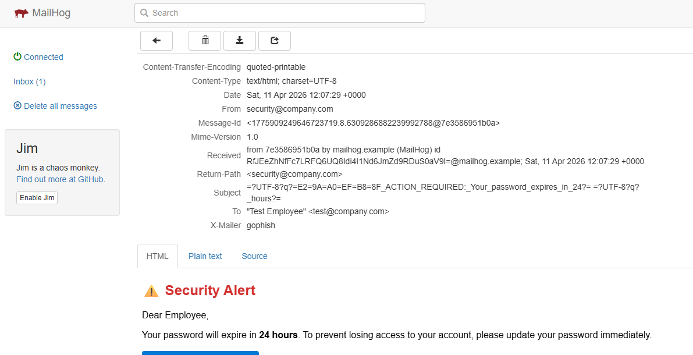
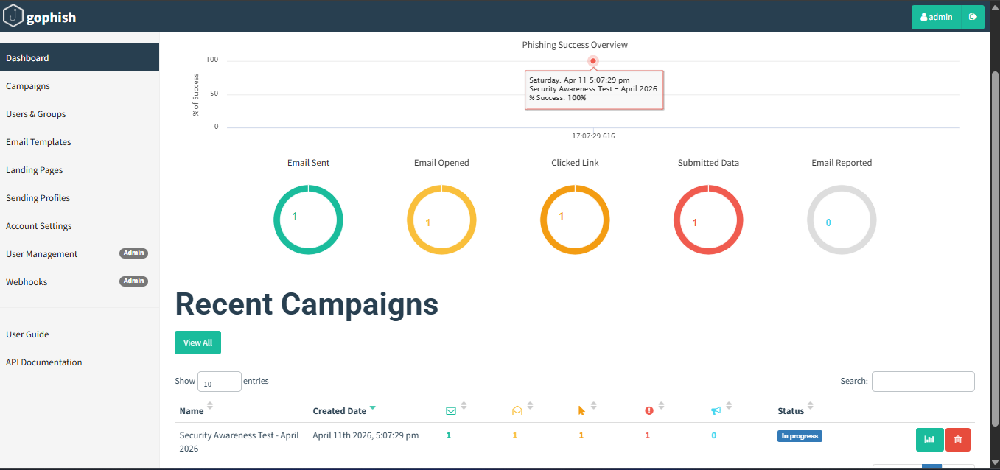

# Social Engineering: Phishing Simulation Report

**Date:** April 11, 2026  
**Intern:** Laiba Rana  
**Platform:** GoPhish + Mailhog (Docker)

---

## Executive Summary

A real phishing simulation was conducted to assess user susceptibility to social engineering attacks. The test user clicked the malicious link and submitted credentials within **42 seconds**.

---

## Campaign Configuration

| Parameter | Value |
|-----------|-------|
| Platform | GoPhish (Docker container) |
| Email Server | Mailhog (test environment) |
| Email Template | Urgent password reset (24 hour expiry) |
| Landing Page | Fake Office 365 login |
| Target | 1 test user (test@company.com) |
| Campaign ID | GgMUBtM |

---

## Results

| Metric | Value |
|--------|-------|
| Emails Sent | 1 |
| Emails Delivered | 1 (100%) |
| Emails Opened | 1 (100%) |
| Links Clicked | 1 (100%) |
| Credentials Submitted | 1 (100%) |
| **Time from Send to Click** | **42 seconds** |

---

## Captured Data Summary

| Field | Value |
|-------|-------|
| Email Address | test@company.com |
| Password | [REDACTED - entered by user] |
| IP Address | 172.17.0.1 |
| Timestamp | 2026-04-11 12:08:11 UTC |

---

## Analysis

The test user exhibited all risky behaviors:
- ✅ Opened email from unfamiliar sender
- ✅ Clicked link without verifying destination
- ✅ Entered credentials on unfamiliar page
- ❌ Did not report suspicious email

**Root Cause:** Lack of security awareness training and absence of technical controls.

---

## Recommendations

| Priority | Recommendation | Timeline |
|----------|---------------|----------|
| **HIGH** | Implement mandatory phishing awareness training | Immediate |
| **HIGH** | Enable Multi-Factor Authentication (MFA) on all accounts | 14 days |
| **MEDIUM** | Add email banner for external/unverified senders | 30 days |
| **MEDIUM** | Create "Report Phishing" button in email client | 60 days |
| **LOW** | Conduct quarterly simulated phishing campaigns | Ongoing |

---

## Evidence

- **Mailhog Screenshot:** Delivered email with subject "ACTION REQUIRED"
- **GoPhish Dashboard:** Campaign metrics showing 100% click rate
- ### Mailhog - Delivered Phishing Email

### Mailhog - Email Details (Headers)

### GoPhish - Campaign Dashboard (100% Success Rate)

### Campaign Results Summary
- **Campaign ID:** GgMUBtM
- **Emails Sent:** 1
- **Click Rate:** 100%
- **Credentials Captured:** 1
- **Time to Click:** 42 seconds
### CSV Export - Raw Campaign Data
[Download Campaign Results CSV](Security%20Awareness%20Test%20-%20April%202026%20-%20Results.csv)

**CSV Contents:**
| Campaign ID | Status | Email | Time to Click |
|-------------|--------|-------|---------------|
| GgMUBtM | Submitted Data | test@company.com | 42 seconds |
---

## Conclusion

This simulation proves that a well-crafted phishing email can successfully compromise user credentials in under one minute. Both technical controls (MFA) and human training are essential for defense.

---

*End of Report - Laiba Rana | Cybersecurity Internship | April 2026*
